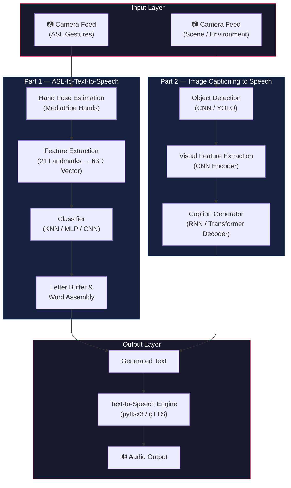
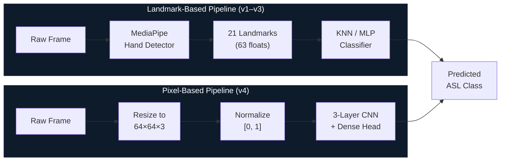
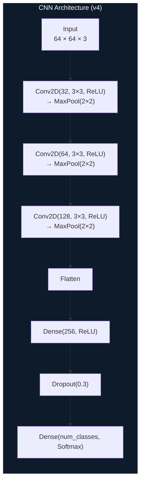
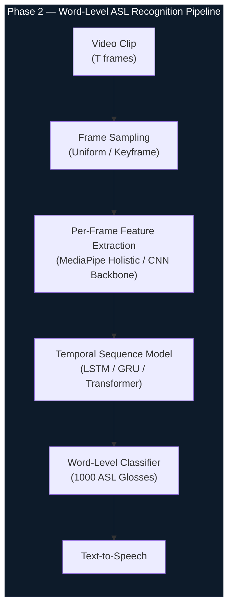
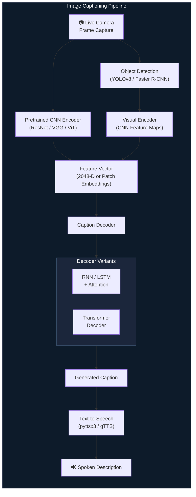

# S1gnvers3

**ASL-to-Text-to-Speech & Image-Captioning-to-Speech — An Assistive Communication System**

S1gnvers3 is a dual-purpose assistive technology project designed to bridge communication gaps for individuals with hearing and visual impairments. The system comprises two independent but philosophically linked pipelines: one that translates American Sign Language (ASL) gestures into spoken English in real time, and another that converts live visual scenes into descriptive spoken narration for visually impaired users. Both pipelines converge on a common text-to-speech output layer, making the system a unified framework for accessibility-driven perception and communication.

---

## Table of Contents

- [System Architecture Overview](#system-architecture-overview)
- [Part 1 — ASL-to-Text-to-Speech](#part-1--asl-to-text-to-speech)
  - [Pipeline Architecture](#pipeline-architecture)
  - [Phase 1: Static Alphabet Recognition (Implemented)](#phase-1-static-alphabet-recognition-implemented)
    - [v1 — MediaPipe + KNN Baseline](#v1--mediapipe--knn-baseline)
    - [v2 — KNN with OpenCV Runtime](#v2--knn-with-opencv-runtime)
    - [v3 — MLP Classifier](#v3--mlp-classifier)
    - [v4 — CNN on Raw Pixel Input](#v4--cnn-on-raw-pixel-input)
  - [Phase 2: Word-Level Sign Recognition (Planned)](#phase-2-word-level-sign-recognition-planned)
- [Part 2 — Image Captioning to Speech](#part-2--image-captioning-to-speech)
- [Evaluation & Results](#evaluation--results)
- [Repository Structure](#repository-structure)
- [Setup & Installation](#setup--installation)
- [Datasets](#datasets)
- [Future Work](#future-work)

---

## System Architecture Overview

At its highest level, S1gnvers3 is structured as two parallel perception-to-speech systems that share a common TTS output stage. The ASL pipeline handles gesture recognition from hand pose or pixel data, while the image captioning pipeline handles scene understanding from camera frames. Both are designed to operate in real time on live camera feeds.



---

## Part 1 — ASL-to-Text-to-Speech

### Pipeline Architecture

The ASL recognition system has been developed iteratively across four versions, each exploring a different approach to the core classification problem. All versions share a common pipeline structure: a camera captures hand gestures frame-by-frame, features are extracted from each frame (either as skeletal landmarks or raw pixels), a classifier maps those features to one of 36 ASL classes (A–Z and 0–9), and recognized characters are accumulated into a text buffer that is ultimately passed to a TTS engine.

The critical architectural decision across these versions is the choice of **feature representation**. Versions 1 through 3 use MediaPipe's hand pose estimator to reduce each frame to a 63-dimensional landmark vector (21 hand keypoints × 3 coordinates each), meaning the classifier operates on a compact, semantically meaningful representation of hand geometry. Version 4 abandons this intermediate representation entirely and feeds raw 64×64 RGB images directly into a convolutional neural network, letting the model learn its own spatial features end-to-end.



---

### Phase 1: Static Alphabet Recognition (Implemented)

Phase 1 focuses exclusively on recognizing static ASL fingerspelling alphabets and digits from individual frames. Each version below is a self-contained implementation that can be run independently.

#### v1 — MediaPipe + KNN Baseline

**Directory:** `v1 - mediapipe implementation/`

This is the foundational implementation and establishes the core design pattern used across the project. The preprocessing stage (`data_preprocessing.py`) iterates over a folder-structured image dataset where each subfolder corresponds to one ASL class. For every image, MediaPipe's `Hands` solution is invoked in static image mode to detect hand landmarks. Each detected hand yields 21 keypoints, and each keypoint provides normalized x, y, and z coordinates relative to the image frame, resulting in a flat 63-element feature vector per image. These vectors and their associated labels are serialized as NumPy `.npy` files (`features.npy` and `labels.npy`) for downstream consumption.

The classifier is a standard K-Nearest Neighbors model from scikit-learn with `k=5` during training (`train_knn.py`) and `k=3` during the Streamlit app's runtime — a minor discrepancy worth noting. KNN was chosen as the initial baseline because it requires no training in the gradient descent sense; it simply memorizes the training set and classifies new points by majority vote among the nearest neighbors in the 63D landmark space.

The real-time application (`app.py`) is built on Streamlit. It opens the system webcam, extracts landmarks from each frame, queries the KNN model for a prediction, and appends the predicted character to a running buffer. A "fist" gesture is treated as a space character to allow rudimentary word separation. The accumulated text can be spoken aloud using `pyttsx3`, a local offline TTS engine that wraps platform-native speech synthesis APIs (SAPI5 on Windows, NSSpeechSynthesizer on macOS, espeak on Linux).

#### v2 — KNN with OpenCV Runtime

**Directory:** `v2 - knn implementation/`

Version 2 retains the same KNN model and MediaPipe landmark extraction pipeline but replaces the Streamlit-based UI with a native OpenCV window loop. This was done to reduce the overhead and latency introduced by Streamlit's reactive re-rendering model, which is not well-suited for real-time video streaming at high frame rates. The OpenCV loop in `real_time_detection.py` runs a standard `while True` capture-process-display cycle with `cv2.imshow`, overlaying the predicted label directly onto the video frame using `cv2.putText`. A debug script (`real_time_hand_debug.py`) is also included for visualizing raw MediaPipe hand detections without classification, which is useful for verifying that landmarks are being tracked correctly before feeding them to the model.

The architectural change here is purely at the application layer — the model, features, and classification logic are identical to v1. The motivation is pragmatic: OpenCV's `imshow` renders frames synchronously with minimal abstraction, giving tighter control over the capture-predict-render loop and making it easier to measure per-frame latency.

#### v3 — MLP Classifier

**Directory:** `v3 - mlp implementation/`

Version 3 replaces the KNN classifier with a Multi-Layer Perceptron (MLP), transitioning from a non-parametric, instance-based learner to a parametric neural network. The MLP is configured with two hidden layers of 128 and 64 neurons respectively, both using ReLU activation, and is trained for up to 500 iterations using scikit-learn's `MLPClassifier` with the Adam optimizer and default learning rate scheduling.

A key addition in this version is **feature normalization**. During training (`train_mlp.py`), the 63D landmark vectors are zero-mean normalized per feature dimension: each coordinate is shifted by the global mean and scaled by the global standard deviation across the training set, with a small epsilon (1e-6) added to avoid division by zero. This normalization is critical for gradient-based optimizers because the raw MediaPipe coordinates (which lie roughly in [0, 1] for x and y but can vary more widely for z) would otherwise create an uneven loss landscape that slows convergence.

However, there is a **normalization inconsistency** in the real-time inference script (`real_time_mlp.py`): at inference time, each incoming landmark vector is normalized using its own per-sample mean and standard deviation rather than the training set's global statistics. This means the normalization applied during inference does not exactly match what the model was trained on, which could introduce subtle prediction errors — though in practice the model still achieves near-perfect accuracy on the test split (99.7% overall, with a weighted F1 of 1.00), suggesting the landmark distributions are stable enough to absorb this mismatch.

The real-time detection loop follows the same OpenCV pattern established in v2.

#### v4 — CNN on Raw Pixel Input

**Directory:** `v4 - cnn implementation/`

Version 4 represents a fundamental shift in the feature extraction philosophy. Instead of relying on MediaPipe to produce an explicit hand skeleton, this version feeds raw RGB images (resized to 64×64 pixels and normalized to [0, 1]) directly into a convolutional neural network. The CNN is expected to learn both the spatial feature extraction and the classification mapping end-to-end through backpropagation, eliminating the dependency on MediaPipe entirely at inference time.

The network architecture is a straightforward sequential stack of three convolutional blocks followed by a dense classification head:



Each convolutional layer uses 3×3 kernels and is followed by 2×2 max pooling, progressively reducing spatial dimensions while increasing channel depth (32 → 64 → 128). After flattening, a 256-unit dense layer with dropout (p=0.3) serves as the classification bottleneck before the final softmax output. The model is compiled with the Adam optimizer and sparse categorical cross-entropy loss and trained for 20 epochs.

The dataset for v4 uses a pre-split directory structure (`train/`, `val/`, `test/`) loaded via `tf.keras.utils.image_dataset_from_directory`, which handles batching (batch size 32), shuffling, and label encoding automatically. The evaluation pipeline (`evaluate_model`) computes the full suite of metrics — classification report, confusion matrix, weighted precision/recall/F1, and ROC-AUC using one-vs-rest — making this the most rigorously evaluated version in the repo.

The real-time detection script (`real_time_detection.py`) loads the saved Keras model, captures frames from the webcam, preprocesses each frame to 64×64×3 normalized tensors, and displays the argmax prediction with its confidence score.

---

### Phase 2: Word-Level Sign Recognition (Planned)

Phase 1 handles static fingerspelling — individual letters held as fixed hand poses. Phase 2 targets the far more challenging problem of recognizing dynamic ASL signs that correspond to entire words or phrases. Unlike static alphabets, word-level signs are performed as continuous hand, arm, and body movements over time, meaning the recognition system must model **temporal dynamics** rather than single-frame snapshots.

The planned approach will use the **MS-ASL dataset**, which contains thousands of short video clips sourced from YouTube, each annotated with one of 1000 ASL glosses (words). This introduces several new technical requirements compared to Phase 1: the input is now a variable-length video sequence rather than a single image, the feature space must capture motion and temporal ordering, and the classifier must handle a vocabulary that is roughly 28× larger than the 36-class alphabet set.



The likely architecture involves extracting per-frame features — either landmark-based using MediaPipe Holistic (which captures hand, pose, and face landmarks simultaneously) or appearance-based using a pretrained CNN backbone like ResNet or EfficientNet — and feeding the resulting sequence into a temporal model such as an LSTM, GRU, or Transformer encoder. The temporal model's job is to learn the motion signatures that distinguish, for example, the sign for "thank you" (hand moving away from the chin) from the sign for "hello" (hand waving near the head), where individual frames in isolation would be ambiguous.

---

## Part 2 — Image Captioning to Speech

The second major component of S1gnvers3 is an assistive vision system for blind and visually impaired users. The goal is to take a live camera feed — from a smartphone, wearable, or stationary camera — detect and understand the objects and spatial relationships in the scene, generate a natural-language description, and speak it aloud. This gives the user a continuous, hands-free auditory narration of their visual surroundings.



The pipeline is conceptually structured as an **encoder-decoder** system. The encoder stage uses a convolutional neural network (or a Vision Transformer) pretrained on a large-scale image classification task like ImageNet to extract rich visual features from each camera frame. For CNN-based encoders, this typically means taking the output of one of the final convolutional layers — before the classification head — as a spatial feature map or a pooled feature vector. For a model like ResNet-50, this yields a 2048-dimensional vector that encodes high-level semantic content (objects, textures, spatial structure) without being tied to any specific classification vocabulary.

The decoder stage takes this visual feature vector and generates a sequence of words that describe the scene. Two primary decoder architectures are under consideration. The first is an **LSTM-based decoder with attention**, following the classic "Show, Attend and Tell" paradigm, where the LSTM generates one word at a time, attending to different spatial regions of the encoder's feature map at each decoding step. This architecture has the advantage of being well-understood and relatively lightweight. The second option is a **Transformer-based decoder**, which replaces the recurrent structure with self-attention and cross-attention layers, allowing the model to capture long-range dependencies in the caption and attend to visual features more flexibly. Transformer decoders tend to produce more fluent and contextually coherent captions, but are more computationally demanding.

Object detection (via YOLO or similar) may optionally be used as a preprocessing step to identify and localize specific objects in the frame before or alongside the captioning model, which can improve caption accuracy by grounding the decoder's output in detected entities.

---

## Evaluation & Results

### MLP (v3) — Landmark-Based Classification

The MLP classifier achieves a **test accuracy of 99.73%** on the 36-class ASL alphabet + digit recognition task, with a weighted precision, recall, and F1-score all rounding to 1.00. Performance is slightly weaker on classes with very few test samples (e.g., class "0" with only 7 samples has a recall of 0.71, and class "1" with 4 samples has a recall of 0.75), which is expected given that KNN and MLP models are sensitive to class imbalance in small-sample regimes.

### CNN (v4) — Pixel-Based Classification

The CNN achieves **perfect scores across all metrics on the test set**: accuracy, weighted precision, weighted recall, weighted F1, and ROC-AUC (OVR) are all 1.0000. The confusion matrix is a clean diagonal with zero off-diagonal entries. While this is an excellent result, it likely reflects the fact that the dataset images were captured under controlled conditions (consistent backgrounds, lighting, and hand positioning), and real-world deployment would introduce distribution shift from varying lighting, skin tones, camera angles, and cluttered backgrounds.

---

## Repository Structure

```
S1gnvers3/
├── features.npy                          # Preprocessed MediaPipe landmark features (63D vectors)
├── labels.npy                            # Corresponding class labels for each feature vector
├── requirements.txt                      # Python dependencies
├── README.md
│
├── v1 - mediapipe implementation/        # KNN baseline with Streamlit app
│   ├── app.py                            # Streamlit real-time detection + TTS interface
│   ├── data_preprocessing.py             # Extract landmarks from image dataset → .npy
│   ├── train_knn.py                      # Train and serialize KNN model
│   ├── utils.py                          # MediaPipe extraction, TTS, and drawing helpers
│   └── knn_model.pkl                     # Trained KNN model artifact
│
├── v2 - knn implementation/              # KNN with native OpenCV runtime
│   ├── real_time_detection.py            # OpenCV webcam loop with KNN inference
│   ├── real_time_hand_debug.py           # Landmark visualization debug tool
│   ├── data_preprocessing.py             # Feature extraction (same pipeline as v1)
│   ├── train_knn.py                      # KNN training script
│   ├── utils.py                          # Shared utilities
│   └── knn_model.pkl                     # Trained model artifact
│
├── v3 - mlp implementation/              # MLP classifier with feature normalization
│   ├── real_time_mlp.py                  # OpenCV webcam loop with MLP inference
│   ├── train_mlp.py                      # MLP training + evaluation script
│   ├── mlp_model.pkl                     # Trained MLP artifact
│   └── training evaluation.png           # Classification report screenshot
│
├── v4 - cnn implementation/              # End-to-end CNN on raw images
│   ├── train_cnn.py                      # CNN training with full metric evaluation
│   ├── optimized_training.py             # GPU-aware training variant
│   ├── real_time_detection.py            # OpenCV webcam loop with CNN inference
│   ├── data_split.py                     # Dataset splitting utility
│   ├── utils.py                          # Image loading and preprocessing
│   ├── results.png                       # Test set evaluation metrics
│   └── confusion matrix.png             # Test set confusion matrix heatmap
│
└── cnn_asl_model/                        # Saved TensorFlow/Keras CNN model
    ├── saved_model.pb
    ├── keras_metadata.pb
    └── variables/
```

---

## Setup & Installation

**Prerequisites:** Python 3.8 or higher, pip, and a working webcam for real-time detection.

```bash
# Clone the repository
git clone https://github.com/InvictusRex/S1gnvers3.git
cd S1gnvers3

# Create and activate a virtual environment (recommended)
python -m venv venv
source venv/bin/activate        # Linux / macOS
venv\Scripts\activate           # Windows

# Install dependencies
pip install -r requirements.txt
```

**Running the Streamlit app (v1):**

```bash
cd "v1 - mediapipe implementation"
streamlit run app.py
```

**Running the OpenCV real-time detection (v2/v3/v4):**

```bash
cd "v2 - knn implementation"
python real_time_detection.py

# or for MLP:
cd "v3 - mlp implementation"
python real_time_mlp.py

# or for CNN:
cd "v4 - cnn implementation"
python real_time_detection.py
```

**To retrain a model from scratch**, ensure your dataset is structured as `dataset/<class_name>/<image_files>` and run the corresponding `data_preprocessing.py` (for v1–v3) or `train_cnn.py` (for v4).

---

## Datasets

**Phase 1 (Static Alphabet Recognition):** The project uses a folder-structured image dataset of ASL hand gestures covering A–Z and 0–9. Each class folder contains hundreds of images of a single hand sign captured against controlled backgrounds. The dataset is preprocessed into `features.npy` and `labels.npy` for landmark-based models, or loaded directly from the split directory structure for the CNN.

**Phase 2 (Word-Level Recognition — Planned):** The [MS-ASL dataset](https://www.microsoft.com/en-us/research/project/ms-asl/) will be used for word-level sign recognition. MS-ASL contains over 25,000 annotated video clips spanning 1,000 ASL signs, sourced from YouTube videos of ASL signers. Each clip is labeled with a gloss (English word) and comes with temporal boundaries within the source video.

**Image Captioning (Part 2 — Planned):** Standard image captioning datasets such as MS-COCO Captions or Flickr30k will be used for training the encoder-decoder captioning model.

---

## Future Work

The immediate next steps for the project include implementing the MS-ASL video-based word recognition pipeline using temporal sequence models (LSTM/Transformer) over frame-level features, building and training the image captioning encoder-decoder system with attention mechanisms, integrating both pipelines into a unified real-time application with a shared TTS output layer, and conducting robustness testing under real-world conditions including variable lighting, backgrounds, and camera angles. Longer-term goals include expanding to continuous sign language recognition (sentences rather than isolated signs), multilingual sign language support, and deployment on edge devices for portable assistive use.
