# FULCRUM

**Framework for Unified Linguistic Captioning, Recognition, and User-assistive Modelling**

FULCRUM is a dual-purpose assistive technology system built to address two distinct but complementary communication barriers. The first component targets individuals who are deaf or hard of hearing: it recognizes American Sign Language (ASL) gestures in real time — ranging from static fingerspelled alphabets to dynamic word-level signs — and converts them into spoken English so that a non-signing listener can understand the signer without any knowledge of ASL. The second component targets individuals who are blind or visually impaired: it captures a live camera feed of the user's environment, generates a natural-language description of the scene using image captioning, and reads it aloud so the user receives a continuous auditory understanding of their surroundings. Both components converge on a shared text-to-speech output layer, making FULCRUM a unified perception-to-speech framework for accessibility.

---

## High-Level System Architecture

FULCRUM is structured as two parallel perception-to-speech pipelines that operate independently but share a common TTS output stage. Each pipeline takes a live camera feed as input, applies a domain-specific perception model (gesture recognition or scene understanding), produces an intermediate text representation, and converts that text to speech. The two pipelines are designed to be deployable separately or together depending on the user's needs.

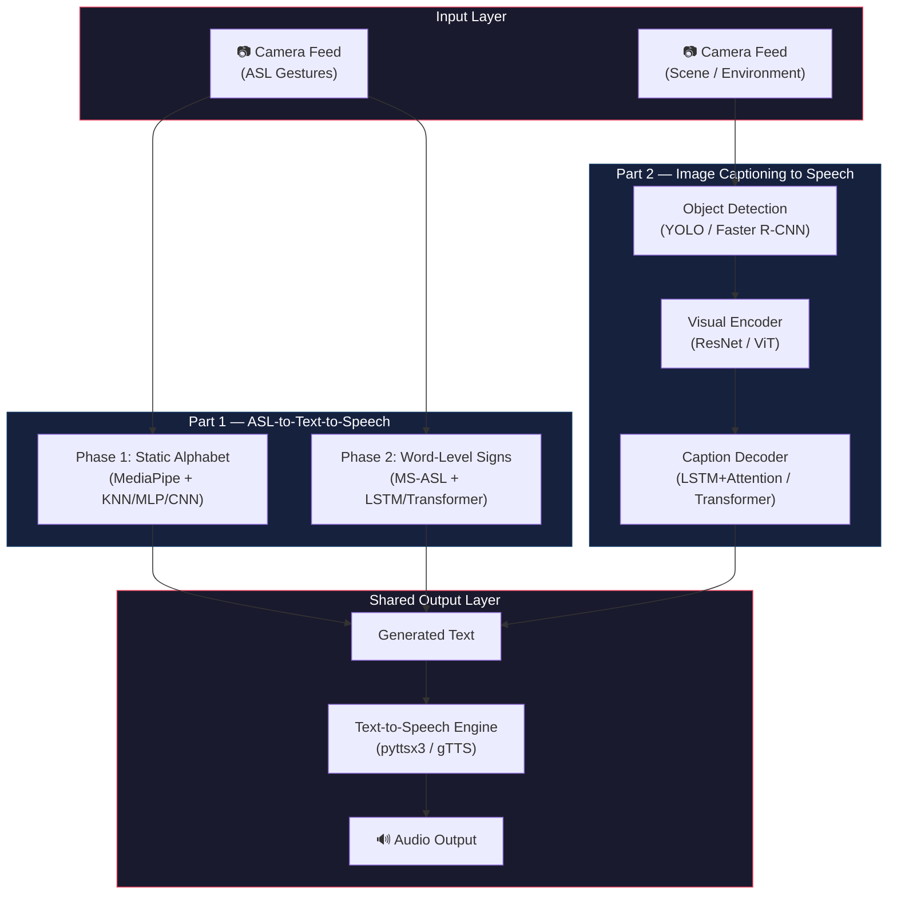

---

## Part 1 — ASL Recognition to Speech (For Hearing-Impaired Users)

The first component of FULCRUM addresses the communication barrier faced by deaf and hard-of-hearing individuals when interacting with people who do not understand ASL. The system observes the signer through a camera, interprets their gestures, converts the recognized signs into English text, and speaks the text aloud. This component is developed in two phases: Phase 1 handles static fingerspelled alphabets and digits (individual hand poses held still), and Phase 2 extends to dynamic word-level signs that involve motion over time.

### Phase 1: Static Alphabet Recognition (Implemented)

Phase 1 has been fully implemented across four iterative approaches, each exploring a different classification strategy while sharing a common pipeline structure: capture a video frame, extract features from the hand region, classify the features as one of 36 ASL classes (A–Z and 0–9), buffer the recognized characters into words and sentences, and pass the accumulated text to a TTS engine.

The critical architectural decision across these approaches is the choice of **feature representation**. The first three use MediaPipe to reduce each frame to a compact 63-dimensional hand landmark vector, while the fourth feeds raw pixel data into a CNN that learns its own features end-to-end.

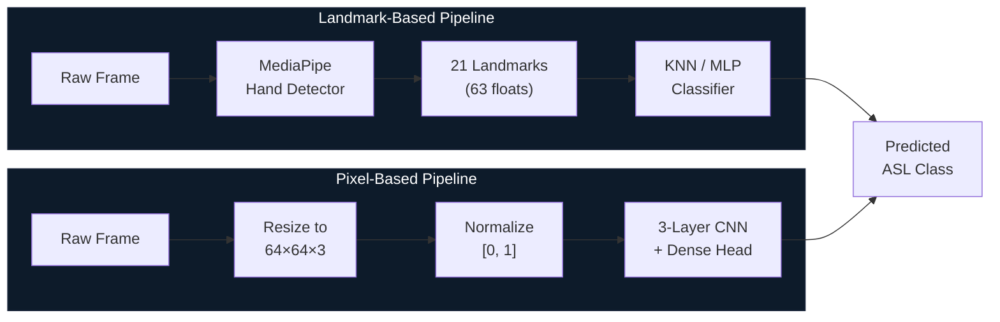

#### Feature Extraction — MediaPipe Hand Landmarks

The first three approaches all share the same feature extraction front-end built on Google's MediaPipe Hands solution. MediaPipe Hands is a real-time hand tracking pipeline that uses a two-stage detector: a palm detection model localizes the hand bounding box in the frame, and a hand landmark model then predicts the 3D coordinates of 21 keypoints (wrist, thumb base through tip, index finger base through tip, and so on for all five fingers) within that bounding box. Each keypoint provides normalized x, y, and z coordinates relative to the image dimensions, yielding a flat 63-element vector (21 × 3) per detected hand.

This landmark representation is powerful for sign language recognition because it abstracts away irrelevant visual variation — skin tone, lighting conditions, background clutter, sleeve length — and encodes only the geometric configuration of the hand. Two hands performing the same ASL letter under completely different visual conditions will produce nearly identical landmark vectors, which dramatically simplifies the downstream classification task.

The preprocessing stage (`data_preprocessing.py`) iterates over a folder-structured image dataset where each subfolder corresponds to one ASL class. For every image, MediaPipe is invoked in static image mode to extract landmarks, which are then serialized alongside their labels as NumPy `.npy` files (`features.npy` and `labels.npy`) for downstream model training.

#### MediaPipe + KNN Baseline

The foundational implementation pairs the MediaPipe landmark pipeline with a K-Nearest Neighbors classifier from scikit-learn. KNN was chosen as the initial baseline because it requires no training in the gradient descent sense — it memorizes the entire training set and classifies new points by majority vote among the k nearest neighbors in the 63D landmark space. The training script uses `k=5`, while the Streamlit runtime uses `k=3`, a minor inconsistency that does not significantly affect results given the high separability of the landmark features.

The real-time application (`app.py`) is built on Streamlit and implements a character buffering system: each predicted letter is appended to a running text buffer, with a "fist" gesture mapped to a space character for word separation. The accumulated sentence can be spoken aloud at any time using `pyttsx3`. This version served as the proof-of-concept that validated the MediaPipe-to-classifier-to-TTS pipeline before subsequent versions optimized individual components.

#### KNN + OpenCV Runtime

This approach retains the identical KNN model and landmark extraction pipeline but replaces the Streamlit UI with a native OpenCV `imshow` loop. Streamlit's reactive re-rendering model introduces overhead and latency that is not well-suited for real-time video processing, so the switch to OpenCV's synchronous capture-process-display cycle gives tighter control over per-frame latency. A debug script (`real_time_hand_debug.py`) is included for visualizing raw landmark detections without classification, which is useful for verifying tracking quality. The architectural change is purely at the application layer — the model and classification logic are unchanged.

#### MLP Landmark-Based Classifier

This approach replaces KNN with a Multi-Layer Perceptron, transitioning from a non-parametric instance-based learner to a parametric neural network. The MLP uses two hidden layers (128 and 64 neurons, both ReLU-activated) trained for up to 500 iterations with the Adam optimizer via scikit-learn's `MLPClassifier`.

A key addition is **feature normalization**: during training, the 63D landmark vectors are zero-mean normalized per feature dimension (each coordinate shifted by the global mean and scaled by the global standard deviation, with epsilon=1e-6 for numerical stability). This is critical for gradient-based optimization because raw MediaPipe coordinates have inconsistent scales across dimensions.

There is a notable **normalization inconsistency** in the inference script: at runtime, each incoming vector is normalized using its own per-sample statistics rather than the training set's global statistics. Despite this mismatch, the model achieves 99.7% test accuracy, suggesting the landmark distributions are stable enough to absorb it — but it would be a source of subtle errors under more challenging conditions.

#### CNN Pixel-Based Classifier

This approach represents a fundamental shift in the feature extraction strategy by feeding raw 64×64 RGB images directly into a convolutional neural network, eliminating the MediaPipe dependency entirely. The CNN learns both spatial feature extraction and classification end-to-end through backpropagation.

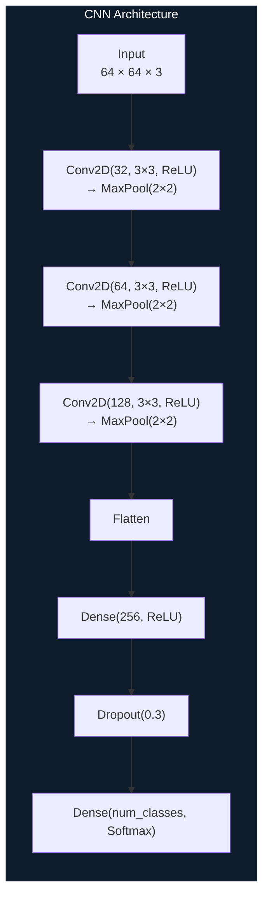

The architecture stacks three convolutional blocks (32 → 64 → 128 filters, all 3×3 kernels with 2×2 max pooling), followed by a 256-unit dense layer with 30% dropout before the final softmax. The model is trained for 20 epochs using Adam and sparse categorical cross-entropy on a pre-split directory structure loaded via `tf.keras.utils.image_dataset_from_directory` (batch size 32). The evaluation pipeline computes the full metric suite: classification report, confusion matrix, weighted precision/recall/F1, and ROC-AUC (one-vs-rest).

#### Text-to-Speech Integration

All Phase 1 approaches use `pyttsx3` for text-to-speech output. `pyttsx3` is an offline TTS engine that wraps platform-native speech synthesis APIs — SAPI5 on Windows, NSSpeechSynthesizer on macOS, and espeak on Linux. It was chosen over cloud-based alternatives (Google TTS, Amazon Polly) to eliminate network latency and ensure the system works fully offline. The speech rate is configurable; the Streamlit app sets it to 150 words per minute for clarity.

#### Phase 1 Results

The **MLP** achieves a test accuracy of **99.73%** across 6,055 test samples spanning 36 classes, with weighted precision/recall/F1 all at 1.00. Minor weaknesses appear on classes with very low sample counts (class "0" recall = 0.71 on 7 samples, class "1" recall = 0.75 on 4 samples), which is expected behavior for models operating under class imbalance.

The **CNN** achieves **perfect scores on all metrics**: accuracy, weighted precision, weighted recall, weighted F1, and ROC-AUC (OVR) are all 1.0000, with a perfectly diagonal confusion matrix. This likely reflects the controlled conditions of the dataset (consistent backgrounds, lighting, positioning) rather than guaranteed robustness under real-world distribution shift.

---

### Phase 2: Word-Level Sign Recognition Using MS-ASL

#### Why Word-Level Recognition Is Necessary

Phase 1's fingerspelling recognition handles individual letters, which covers only a small fraction of how ASL is actually used in conversation. In practice, ASL signers communicate primarily through word-level and phrase-level signs — dynamic gestures involving movement of the hands, arms, and often the face and torso over time. The sign for "thank you," for instance, involves moving the flat hand forward and downward from the chin, while "help" involves placing one fist on an open palm and lifting both hands upward. These signs cannot be captured by analyzing a single static frame; the system must understand the **temporal trajectory** of the movement across multiple frames to distinguish between signs that may look identical at any single point in time.

Phase 2 extends the system from static single-frame classification to dynamic video-sequence recognition, increasing the vocabulary from 36 classes (A–Z, 0–9) to approximately 1,000 word-level ASL glosses. This requires fundamentally different model architectures that can process sequential data and learn motion-based features.

#### The MS-ASL Dataset

The [MS-ASL dataset](https://www.microsoft.com/en-us/research/project/ms-asl/) (Microsoft American Sign Language Dataset) is a large-scale, real-world dataset for word-level ASL recognition. It contains over 25,000 annotated video clips extracted from YouTube ASL instructional and conversational videos. Each clip is labeled with one of 1,000 ASL glosses (English word translations) and includes temporal start and end timestamps within the source YouTube video.

Several characteristics of MS-ASL make it particularly suitable for this project and simultaneously challenging. First, the videos are captured "in the wild" — they feature diverse signers with different skin tones, body proportions, signing speeds, and styles, recorded under varying lighting conditions, camera angles, and background environments. This is a sharp contrast to the controlled-condition dataset used in Phase 1 and ensures the model must generalize across real-world variation. Second, the class distribution is imbalanced: common signs have hundreds of examples while rarer signs may have only a handful, which will require strategies like class-weighted loss functions, oversampling, or data augmentation during training. Third, the clips are variable-length (typically 1–5 seconds), so the model must handle sequences of different temporal durations.

The dataset is distributed as JSON annotation files containing YouTube video IDs and frame-level timestamps rather than the raw videos themselves. A download and extraction pipeline is needed to pull the source videos from YouTube, trim them to the annotated segments, and preprocess them into a format suitable for model training.

#### Video Preprocessing and Frame Sampling

Raw video clips must be converted into fixed-length input sequences before they can be fed to a temporal model. Since clips vary in duration and frame rate, a frame sampling strategy is necessary to produce uniform-length sequences across the dataset.

The two primary approaches are **uniform temporal sampling** and **keyframe-based sampling**. Uniform sampling divides each clip into T equal segments and selects one frame from each segment (either the middle frame or a random frame within the segment), producing a fixed-length sequence of T frames regardless of the original clip duration. This is simple and effective, and is the most commonly used strategy in video classification literature. Keyframe-based sampling instead selects frames with the highest optical flow magnitude or the greatest visual change between consecutive frames, which can better capture the moments of peak motion that carry the most discriminative information for sign recognition — but it is more computationally expensive and can produce inconsistent temporal spacing.

Additional preprocessing includes resizing all frames to a standard spatial resolution (e.g., 224×224 for pretrained CNN backbones or 64×64 for lightweight models), normalizing pixel values to [0, 1] or to ImageNet statistics if using pretrained encoders, and optionally applying data augmentation (random cropping, horizontal flipping where semantically valid, color jittering, temporal jittering) to increase training set diversity and reduce overfitting.

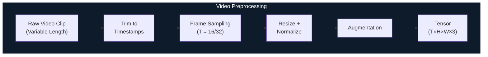

#### Per-Frame Feature Extraction Strategies

Once a video clip has been sampled into T frames, each frame must be converted into a feature representation before being passed to a temporal model. Two broad strategies are under consideration, each with distinct tradeoffs.

**Strategy A: Landmark-Based Features (MediaPipe Holistic).** This extends the approach used in Phase 1 by replacing MediaPipe Hands with MediaPipe Holistic, which simultaneously tracks hand landmarks (21 keypoints per hand × 2 hands = 42 keypoints), body pose landmarks (33 keypoints for the torso, arms, and head), and face mesh landmarks (468 keypoints). For word-level signs, body pose is essential because many signs involve arm and shoulder movement, and facial expression carries grammatical information in ASL (e.g., raised eyebrows for yes/no questions). The combined landmark set produces a high-dimensional feature vector per frame (potentially 500+ coordinates), but it remains a compact, structured representation that is invariant to appearance variation. The downside is that landmark detection can fail or produce noisy results on occluded or low-resolution frames, and the fixed keypoint topology cannot capture fine-grained information like hand texture or finger overlap.

**Strategy B: Appearance-Based Features (CNN Backbone).** Each frame is passed through a pretrained CNN — such as ResNet-50, EfficientNet-B0, or a video-specific backbone like I3D or SlowFast — and the output of one of the final layers (before the classification head) is used as the feature representation. For ResNet-50, this yields a 2048-dimensional vector per frame that encodes rich visual information including object appearance, spatial layout, and texture. This approach captures everything visible in the frame, including details that landmarks miss, but it is sensitive to appearance variation (lighting, background, clothing) and requires significantly more computation. Using pretrained ImageNet weights provides a strong initialization, but fine-tuning on ASL data would be necessary to adapt the features to hand and body poses specifically.

**Strategy C: Hybrid.** A combination of both, where landmark features and CNN features are extracted in parallel and concatenated before being fed to the temporal model. This provides both the geometric invariance of landmarks and the visual richness of CNN features, at the cost of increased model complexity.

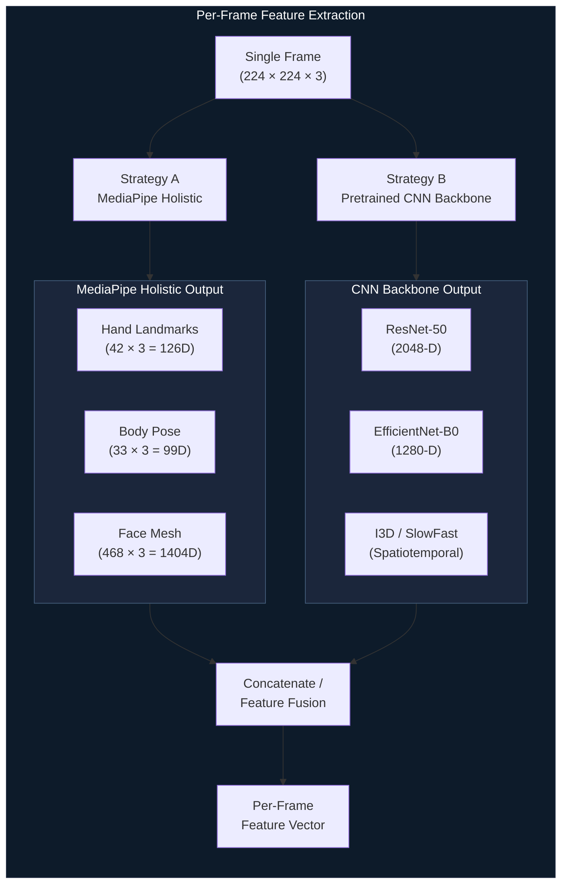

#### Temporal Sequence Modeling

The core challenge of word-level sign recognition is modeling how hand and body configurations evolve over time. A single frame of the sign for "book" (two palms opening outward) might look identical to a frame from the sign for "open," so the model must learn to distinguish them based on the full motion trajectory. Three families of temporal models are under consideration.

**LSTM / GRU (Recurrent Networks).** Long Short-Term Memory and Gated Recurrent Unit networks process the frame-level feature sequence one step at a time, maintaining a hidden state that accumulates information across the sequence. A bidirectional LSTM can read the sequence in both forward and reverse directions, which is beneficial for isolated sign recognition (where the full clip is available before classification) because the model can use both past and future context to classify each sign. Stacking two or three LSTM layers with dropout between them is a standard configuration. Recurrent models are well-suited to variable-length sequences and have a smaller parameter footprint than Transformers, making them practical for training on smaller datasets.

**Transformer Encoder.** A Transformer encoder processes the entire sequence in parallel using self-attention, allowing every frame to attend to every other frame regardless of temporal distance. This eliminates the vanishing gradient problem that can affect LSTMs on long sequences and enables the model to capture long-range temporal dependencies more effectively. Positional encodings (sinusoidal or learned) are added to the frame features to inject temporal ordering information since the self-attention mechanism is inherently permutation-invariant. The tradeoff is that Transformers typically require more training data to generalize well and are more computationally expensive due to the quadratic attention computation over the sequence length.

**Hybrid CNN-RNN / CNN-Transformer.** These architectures use a CNN (or 3D CNN) to extract short-range spatiotemporal features from small groups of consecutive frames, and then feed the resulting clip-level features into an RNN or Transformer to capture longer-range temporal structure. For example, an I3D backbone can process 16-frame segments to produce spatiotemporal features, which are then sequenced and processed by an LSTM. This hierarchical approach can be more efficient than processing every frame independently.

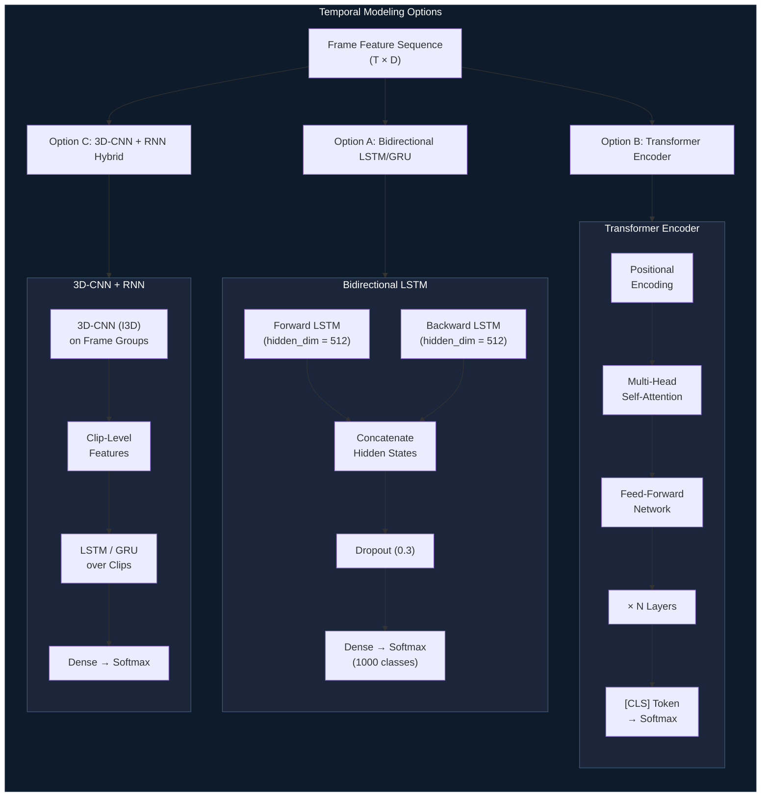

#### Classification Head and Output

The temporal model produces a single fixed-dimensional vector per video clip (e.g., the final hidden state of an LSTM, or the [CLS] token output of a Transformer). This vector is passed through one or more dense layers with dropout regularization before a final softmax layer that outputs a probability distribution over the 1,000 ASL gloss classes. The predicted class is the argmax of this distribution.

For training, sparse categorical cross-entropy is used as the loss function, optionally weighted by inverse class frequency to mitigate the dataset's class imbalance. Label smoothing (e.g., 0.1) can also be applied to prevent the model from becoming overconfident on the training distribution, which improves generalization to unseen signers and environments.

#### Real-Time Inference Pipeline

At inference time, the system operates on a live camera feed using a sliding window approach. A buffer of the most recent T frames is maintained, and at each time step the oldest frame is dropped and the newest frame is appended. The current buffer is passed through the feature extractor and temporal model to produce a prediction. To avoid noisy per-frame outputs, a **smoothing mechanism** is applied: the system only commits a prediction when the same gloss has been the top prediction for a configurable number of consecutive windows (e.g., 5), and a cooldown period prevents the same word from being re-predicted immediately. The committed words are accumulated into a sentence buffer and fed to the TTS engine on demand or at natural pause points.

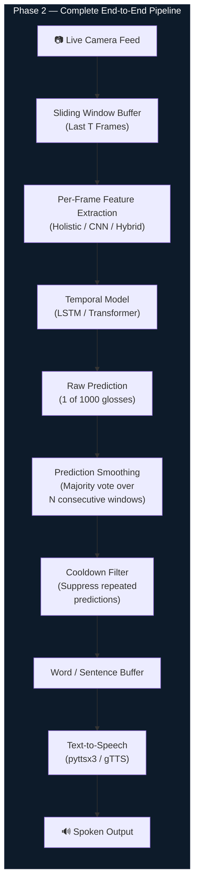

---

## Part 2 — Image Captioning to Speech (For Visually-Impaired Users)

### Problem Formulation and Use Case

The second component of FULCRUM addresses the information access barrier faced by blind and visually impaired individuals. The core idea is to provide a continuous, hands-free auditory description of the user's visual environment: what objects are present, where they are, what is happening, and what the scene looks like. This is achieved by capturing frames from a live camera (mounted on a smartphone, wearable, or placed in a fixed location), running object detection and image captioning models to generate a natural-language description, and converting that description to speech.

The pipeline can be decomposed into four stages: **frame capture** from the camera, **object detection** to identify and localize objects in the scene, **visual feature encoding** to extract a rich representation of the scene, **caption decoding** to generate a natural-language sentence from those features, and **TTS output** to speak the caption. Object detection and feature encoding can operate independently or feed into each other depending on the architecture.

### Object Detection Stage

Object detection serves as a preprocessing step that identifies what entities are present in the scene and where they are located. While the caption decoder can in principle learn to describe scenes without explicit object detection (by relying on the visual encoder's features alone), providing detected object classes and bounding boxes as additional input to the decoder can significantly improve caption accuracy and groundedness — the model is less likely to hallucinate objects that are not present if it has access to explicit detection results.

#### YOLO-Based Detection

YOLO (You Only Look Once) is a single-stage object detector that processes the entire image in one forward pass through a fully convolutional network, simultaneously predicting bounding boxes and class probabilities for all objects in the scene. The latest versions (YOLOv8 and beyond) achieve strong detection accuracy while maintaining real-time inference speeds (30+ FPS on modern GPUs and even on some edge devices), making YOLO the most practical choice for the live camera use case where latency directly impacts user experience.

The YOLO model, pretrained on COCO (80 object classes covering common everyday objects like chairs, tables, cups, people, cars, etc.), can be used directly or fine-tuned on domain-specific data if the target environment contains objects outside the COCO vocabulary. The detection output — a list of (class_label, confidence_score, bounding_box) tuples — can be used in two ways: as a standalone textual description ("I see a person, a laptop, and a coffee cup") for simple use cases, or as structured input to the caption decoder to guide more detailed and spatially aware descriptions.

#### CNN / Faster R-CNN Alternative

Faster R-CNN is a two-stage detector that first generates region proposals (candidate bounding boxes) using a Region Proposal Network (RPN) and then classifies each proposal using a CNN head. It generally achieves higher detection accuracy than single-stage detectors, especially for small objects and crowded scenes, but at a significant speed cost (typically 5–15 FPS). For the assistive use case, Faster R-CNN may be preferable in scenarios where the camera feed is processed at lower frame rates (e.g., captioning every 2–3 seconds rather than every frame) and accuracy is prioritized over latency.

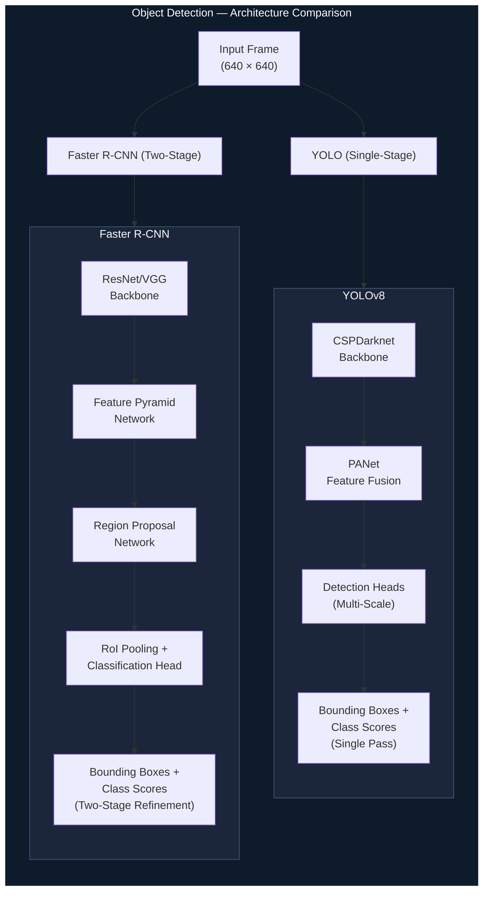

### Visual Feature Encoding

The visual encoder is the backbone of the captioning system. Its job is to transform a raw image into a compact, information-rich feature representation that the caption decoder can use to generate descriptive text. The encoder is typically a deep neural network pretrained on a large-scale image classification task (most commonly ImageNet), with the final classification layer removed so that the output is a feature map or feature vector rather than a class prediction.

#### CNN-Based Encoders (ResNet, VGG, EfficientNet)

The most established approach uses a convolutional neural network pretrained on ImageNet as the encoder. The choice of where to tap into the network determines the nature of the output:

**Global Average Pooled Features:** Taking the output after the final convolutional block and applying global average pooling produces a single feature vector per image (e.g., 2048-D for ResNet-50, 1280-D for EfficientNet-B0). This is a holistic summary of the image content and is the simplest input format for the decoder, but it discards spatial information — the decoder cannot attend to specific regions of the image.

**Spatial Feature Maps:** Taking the output of the final convolutional block before pooling produces a spatial feature map (e.g., 7×7×2048 for ResNet-50), which can be reshaped into a sequence of 49 spatial feature vectors. This is the format used by attention-based decoders, where the decoder learns to attend to different spatial locations of the feature map at each word generation step — for example, attending to the top-left region when generating the word "sky" and the bottom-center region when generating "dog."

ResNet-50 is the most commonly used encoder in image captioning literature due to its strong balance of accuracy, efficiency, and availability of pretrained weights. EfficientNet offers better accuracy-per-FLOP and is preferable for edge deployment. VGG-16 is heavier and slower but is used in some classic captioning architectures.

#### Vision Transformer (ViT) Encoders

Vision Transformers divide the input image into a grid of fixed-size patches (e.g., 16×16 pixels), flatten each patch into a vector, add positional embeddings, and process the resulting sequence through a standard Transformer encoder. The output is a sequence of patch-level feature vectors that naturally encode both local and global image information. ViT encoders pretrained on large datasets (ImageNet-21k, LAION) can produce richer and more contextual features than CNNs, particularly for complex scenes with many interacting objects. The patch-level output format is also naturally compatible with Transformer-based decoders that use cross-attention to attend over the encoder outputs.

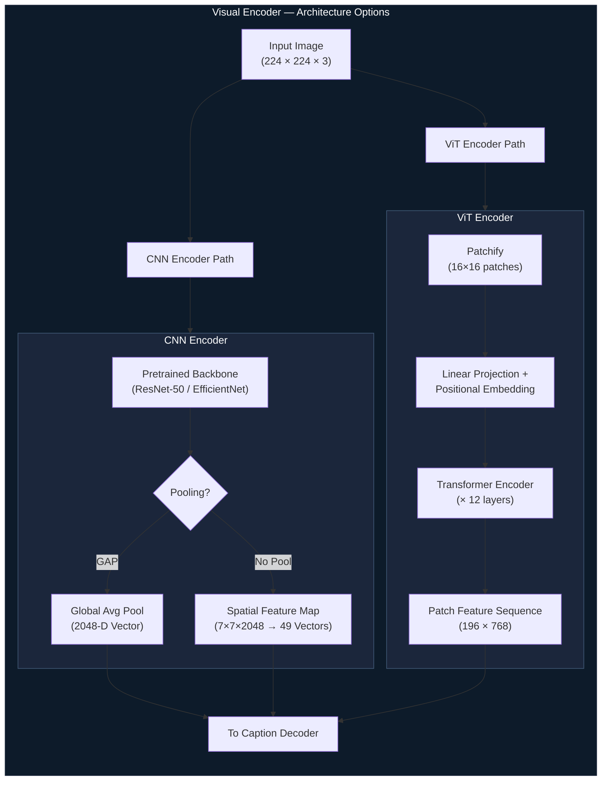

### Caption Generation — Decoder Architectures

The caption decoder takes the visual features produced by the encoder and generates a sequence of words that describes the image. This is fundamentally a **conditional language generation** problem: the model must produce fluent, grammatically correct English text that is conditioned on (grounded in) the visual content of the image.

#### RNN / LSTM Decoder with Attention

The classic approach, pioneered by the "Show, Attend and Tell" architecture, uses an LSTM as the decoder. At each time step, the LSTM takes as input the embedding of the previously generated word (or a start token at the first step), its own previous hidden state, and a context vector computed by attending over the encoder's spatial feature map. The attention mechanism is typically a small neural network (a single hidden layer with a softmax output) that produces a weight distribution over the spatial positions of the feature map, indicating which image regions are most relevant for generating the current word.

The LSTM then outputs a probability distribution over the vocabulary, from which the next word is selected (either greedily via argmax or using beam search to explore multiple candidate sequences and select the highest-scoring one). Generation continues until the model produces an end-of-sequence token or reaches a maximum caption length.

This architecture is well-understood, relatively lightweight (a single-layer LSTM with 512 hidden units is a common configuration), and produces reasonable captions for most everyday scenes. Its main limitation is that the sequential nature of the LSTM means it cannot look ahead — each word is generated based only on words that came before it and the current attention context, which can lead to locally coherent but globally suboptimal captions.

#### Transformer-Based Decoder

A Transformer-based decoder replaces the LSTM with a stack of Transformer decoder layers, each containing masked self-attention (over the generated caption so far), cross-attention (over the encoder's visual features), and a feed-forward network. This architecture has several advantages over LSTM-based decoding. The self-attention over the caption allows each word to attend directly to all previously generated words, capturing long-range dependencies in the text more effectively than the LSTM's hidden state bottleneck. The cross-attention over the encoder features serves the same purpose as the attention mechanism in "Show, Attend and Tell" but is more expressive because it operates in a multi-head fashion, allowing different attention heads to focus on different aspects of the image simultaneously.

Transformer decoders tend to produce more fluent, descriptive, and contextually coherent captions than LSTM decoders, especially for complex scenes. They are also more naturally compatible with ViT encoders, forming a fully Transformer-based encoder-decoder architecture. The tradeoff is higher computational cost and a larger data requirement for training.

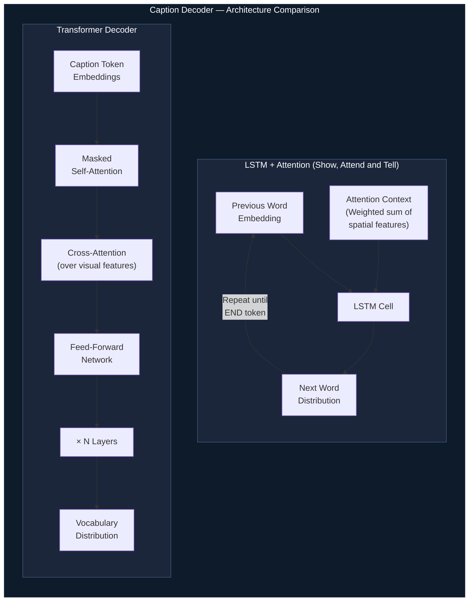

### Training Data and Evaluation Metrics

The image captioning model will be trained on one or both of the following standard benchmark datasets:

**MS-COCO Captions** is the largest and most widely used image captioning dataset, containing approximately 330,000 images with 5 human-written reference captions per image. The images cover a broad range of everyday scenes (indoor and outdoor, people, animals, objects, activities) and the captions provide diverse natural-language descriptions of varying specificity. The standard Karpathy split allocates approximately 113,000 images for training, 5,000 for validation, and 5,000 for testing.

**Flickr30k** contains 31,000 images, each with 5 reference captions, sourced from Flickr. It is smaller than MS-COCO but provides a useful secondary benchmark for cross-dataset evaluation.

Evaluation of captioning quality uses a suite of automatic metrics that compare generated captions against the human reference captions. **BLEU** (bilingual evaluation understudy) measures n-gram precision between the generated and reference captions, with BLEU-1 through BLEU-4 capturing unigram through 4-gram overlap. **METEOR** incorporates synonym matching and stemming in addition to exact n-gram matches, making it more robust to paraphrasing. **CIDEr** (consensus-based image description evaluation) uses TF-IDF weighting to emphasize n-grams that are distinctive to a particular image's reference captions rather than common across all images, making it the most informative single metric for captioning quality. **ROUGE-L** measures the longest common subsequence between generated and reference captions. **SPICE** evaluates captions based on semantic propositional content by parsing both generated and reference captions into scene graphs and comparing them, capturing whether the caption correctly describes the objects, attributes, and relationships in the image.

### Real-Time Captioning Pipeline

In deployment, the image captioning system operates on a live camera feed with a configurable captioning interval. Rather than generating a caption for every frame (which would be redundant and computationally wasteful since consecutive frames are nearly identical), the system captures a frame every N seconds (e.g., every 2–3 seconds), runs the object detection and captioning pipeline, and speaks the resulting description. A **change detection** mechanism can optionally be layered on top: the system compares the current frame's visual features to the previous frame's features using cosine similarity, and only triggers a new caption when the scene has changed significantly (e.g., the user has turned their head, entered a new room, or a new object has appeared). This avoids repetitive descriptions of a static scene and focuses the auditory output on meaningful changes, reducing cognitive load for the user.

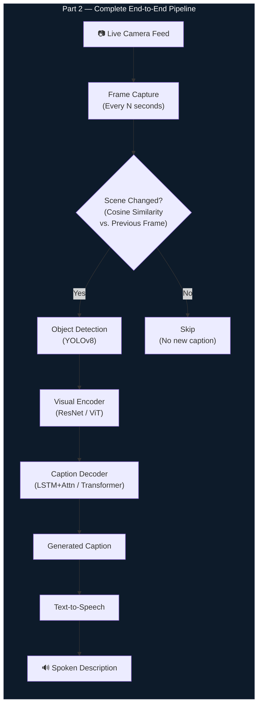

---

## Shared Output Layer — Text-to-Speech

Both Part 1 and Part 2 produce intermediate text that must be converted to speech. The current implementation uses `pyttsx3`, which operates fully offline by wrapping platform-native TTS engines (SAPI5 on Windows, NSSpeechSynthesizer on macOS, espeak on Linux). This ensures zero-latency-from-network and full functionality without internet access, which is important for an assistive device that must work reliably in all environments.

For higher-quality speech output, cloud-based TTS services like Google Text-to-Speech (`gTTS`) or Amazon Polly can be used as alternatives. These services produce more natural-sounding speech with better prosody and intonation, but introduce network dependency and per-request latency. A hybrid approach — using `pyttsx3` as the default with an option to switch to cloud TTS when connectivity is available — may offer the best balance.

---

## Repository Structure

```
FULCRUM/
├── requirements.txt
├── README.md
└── Static Alphabet Recognition/
    ├── features.npy
    ├── labels.npy
    ├── MediaPipe + KNN Baseline/
    ├── KNN + OpenCV Runtime/
    ├── MLP Landmark Based Classifier/
    ├── CNN Pixel Based Classifier/
    └── Saved CNN Models/
```

> Phase 2 (MS-ASL word-level recognition) and Part 2 (image captioning) directories will be added as those components are developed.

---

## Setup & Installation

**Prerequisites:** Python 3.8+, pip, and a working webcam for real-time detection.

```bash
# Clone the repository
git clone https://github.com/InvictusRex/FULCRUM.git
cd FULCRUM

# Create and activate a virtual environment (recommended)
python -m venv venv
source venv/bin/activate        # Linux / macOS
venv\Scripts\activate           # Windows

# Install dependencies
pip install -r requirements.txt
```

**Running the Streamlit app (MediaPipe + KNN Baseline):**

```bash
cd "Static Alphabet Recognition/MediaPipe + KNN Baseline"
streamlit run app.py
```

**Running OpenCV real-time detection:**

```bash
# KNN
cd "Static Alphabet Recognition/KNN + OpenCV Runtime" && python real_time_detection.py

# MLP
cd "Static Alphabet Recognition/MLP Landmark Based Classifier" && python real_time_mlp.py

# CNN
cd "Static Alphabet Recognition/CNN Pixel Based Classifier" && python real_time_detection.py
```

**Retraining from scratch:** Ensure your dataset is structured as `dataset/<class_name>/<image_files>` and run the corresponding preprocessing/training script for your chosen approach.

---

## Datasets Summary

| Component           | Dataset                                                            | Size           | Classes              | Type              |
| ------------------- | ------------------------------------------------------------------ | -------------- | -------------------- | ----------------- |
| Phase 1 (Alphabet)  | Custom ASL Gesture Images                                          | ~30K images    | 36 (A–Z, 0–9)        | Static images     |
| Phase 2 (Words)     | [MS-ASL](https://www.microsoft.com/en-us/research/project/ms-asl/) | 25,000+ clips  | 1,000 glosses        | Video clips       |
| Part 2 (Captioning) | [MS-COCO Captions](https://cocodataset.org/)                       | 330,000 images | N/A (free-form text) | Images + captions |
| Part 2 (Captioning) | [Flickr30k](https://shannon.cs.illinois.edu/DenotationGraph/)      | 31,000 images  | N/A (free-form text) | Images + captions |

---

## Future Work and Roadmap

The project is being developed in a staged approach. Phase 1 (static alphabet recognition) is complete with four implemented approaches. The immediate next milestones are:

- **Phase 2 implementation:** Build the MS-ASL video preprocessing pipeline, implement per-frame feature extraction using MediaPipe Holistic and/or a pretrained CNN backbone, train temporal sequence models (bidirectional LSTM and Transformer encoder) for word-level gloss classification, and benchmark against published results on the MS-ASL leaderboard.

- **Part 2 implementation:** Integrate a pretrained YOLOv8 model for object detection, implement the visual encoder using a frozen or fine-tuned ResNet-50 backbone, train an attention-based LSTM decoder and a Transformer decoder on MS-COCO Captions, evaluate using BLEU, METEOR, CIDEr, and SPICE metrics, and build the real-time captioning loop with change detection.

- **Unified application:** Merge both pipelines into a single application with a mode-switching interface that allows users to select ASL recognition mode or scene captioning mode (or both simultaneously on dual camera inputs).

- **Robustness and deployment:** Conduct testing under real-world conditions (variable lighting, cluttered backgrounds, diverse signers, moving camera), optimize model inference for edge deployment (quantization, pruning, ONNX export), and explore deployment targets including mobile (Android/iOS) and wearable (smart glasses) platforms.
